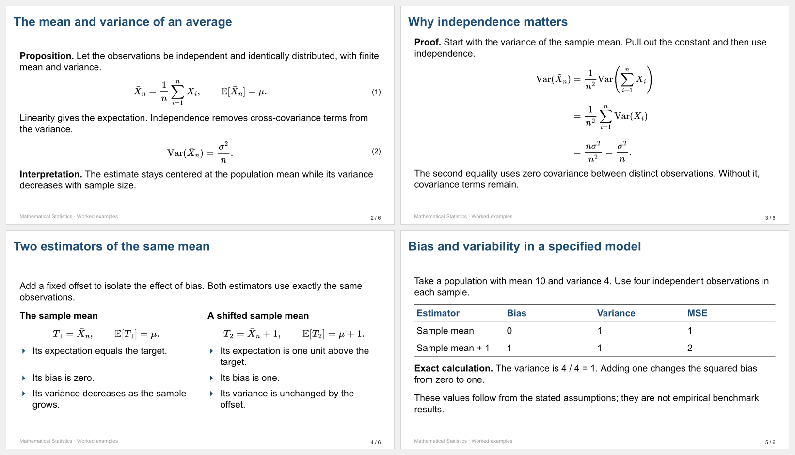

# PaperStage

A formal academic presentation **skill for your existing AI assistant**, with small local PPTX tools.



**New in 0.4:** native editable equations from LaTeX, inline math runs, and Chinese-aware text wrapping. The compact lecture preset retains white 16:9 slides, navy titles, three-line tables and automatic main/appendix numbering. [Chinese example](skills/paperstage/assets/examples/lecture-zh.json) · [Style contract](skills/paperstage/references/lecture-style.md).

Give the AI a paper, research notes, or proposal and an institutional reference. The AI reads the material, builds the argument, designs the slides and reviews the output. PaperStage supplies a reusable research workflow and deterministic helpers. It does not run another model.

## 中文说明

这是供 Codex 等支持 `SKILL.md` 的 AI 使用的技能包，不是网页应用，也不要求安装本地小模型或配置另一套 API Key。

AI 负责理解论文、选择讲述重点、核对证据、适配机构风格并逐页审稿。脚本负责本地提取文本、检查材料结构、导出可编辑文字、原生公式、图表和表格，以及简单翻页淡入。

正式学术演示现在默认采用 `lecture-blue`：16:9 白底、深蓝标题、黑色正文、蓝色三角列表、三线表、课程页脚及自动页码。单栏、双栏、定理与推导都可紧凑编排；正文溢出会明确报错，不自动缩小或删减内容。论文组会、研究报告与答辩沿用这套视觉基准，按研究论证组织内容。用户提供的新参考样式始终优先。

这套样式从参考课件的视觉规则重新实现，公开示例使用自编统计学内容，不包含原课件、作者署名或课程材料。默认 Arial 近似参考文件的 Computer Modern Sans；字体并非完全相同。中文示例指定 Noto Sans CJK SC，需要在目标电脑安装。本次 macOS WPS 测试中 Heiti SC 正确显示为黑体，PingFang SC 则回退为宋体，不能只凭字体名称判断效果。字体不会自动安装或嵌入 PPTX。

不再把杂志式封面、巨大章节数字、整页换色或文字堆砌作为默认设计。中文正文按中西文分配字体，并尽量避免句号落在行首、前括号落在行尾及无故拆分英文单词；原文字符保持不变。公式使用结构化数学对象，不能用空格和 Unicode 字符拼接。详见[中文排版](skills/paperstage/references/chinese-typography.md)与[数学排版](skills/paperstage/references/mathematics.md)。

**隐私边界：**脚本不上传文件，但当前 AI 平台可能会把 AI 读取的材料发给其模型服务商。本地 Skill 不等于 AI 全程离线。不要把论文、密钥或机构私有模板提交进这个公开仓库。

## LaTeX and academic layout refinement

课程输入的 `equation` 块省略 `file` 时，`latex` 默认转换为 PPTX 原生 OMML 公式；正文也支持 `{ "latex": "..." }` 行内公式。常见分式、根式、上下标、矩阵和对齐公式可编辑。JSON 输入保留源码，课程独立公式还会把 LaTeX 写入备注。转换器支持的是有界子集，遇到不支持的构造会报错，不会悄悄改成图片。无需安装 TeX 发行版，所需 Temml 随 `npm ci` 安装。

若 `equation` 明确提供 `file`，则继续使用旧版 PNG/JPEG 公式模式。该模式保留 LaTeX，但图片不能在公式工具中直接编辑，修改后需重新生成图片。随附 7 页英文样例采用这种兼容路径；新增 3 页中文样例采用原生公式。

生成 3 页中文课程样张（先确认 Noto Sans CJK SC 与数学字体可用）：

```sh
node skills/paperstage/scripts/cli.mjs lecture-validate skills/paperstage/assets/examples/lecture-zh.json
node skills/paperstage/scripts/cli.mjs lecture skills/paperstage/assets/examples/lecture-zh.json output/lecture-zh.pptx
```

文本字体由 `fontFace` 指定，独立、行内及表格公式的默认字体由 `mathFontFace` 指定，默认 Cambria Math。字体已安装并不保证每个办公软件都能正确识别或排版；例如本次 WPS 测试中，已安装的 STIX Two Math 仍出现数学排版问题。须检查实际输出，避免字体回退或符号错位。

原生公式已在 **macOS WPS** 中实测显示，并可双击进入公式工具。**尚未在 Microsoft PowerPoint 中实机验收。** artifact-tool 等预览器对行内公式及多行对齐公式的支持不完整，预览缺项不能单独判定原生公式失效；应在实际使用的软件中复核显示和编辑。

生成随附的 7 页英文课程样张：

```sh
node skills/paperstage/scripts/cli.mjs lecture-validate skills/paperstage/assets/examples/lecture.json
node skills/paperstage/scripts/cli.mjs lecture skills/paperstage/assets/examples/lecture.json output/lecture.pptx
```

课程模式与自由布局模式共用导出器。版式支持定义与实例并排、定理与证明线索、对齐推导与三线表；原生表格单元格可混排文字和公式，并按内容设置列宽。更复杂的几何布局可使用自由布局或宿主工具。详见[版面精修](skills/paperstage/references/layout-refinement.md)与[工具约定](skills/paperstage/references/tooling.md#compact-lecture-input)。

## Install

Requires Node.js 22.13 or newer for bundled helpers.

```sh
git clone https://github.com/Studyer-Tang/paperstage-skill.git
cd paperstage-skill
npm ci --prefix skills/paperstage/scripts
```

Copy `skills/paperstage` into your assistant's skill directory, preserving scripts, assets and references. Current [Codex documentation](https://developers.openai.com/codex/skills/) lists `~/.agents/skills/paperstage` for user-wide skills and `.agents/skills/paperstage` for repository skills. Some hosts use configured or legacy paths; consult the actual host discovery rules. For Claude Code use its supported project/personal skill folder, commonly `.claude/skills/paperstage`. Run `npm ci --prefix <installed-skill>/scripts` if copied without dependencies and you need the PPTX helpers.

Do not replace an existing installation containing your own changes. Restart/reload skill discovery if necessary. This package follows the SKILL.md convention; host compatibility and the quality of its model/tools vary.

Example request:

> 使用 $paperstage，把这篇论文做成 15 分钟组会报告。沿用我提供的学校模板，图表保持可编辑，注明主要结论的出处，先检查论证再排版，最后逐页检查实际导出的 PPT。

## Capabilities and boundaries

| Available | Boundary |
| --- | --- |
| Research narration, evidence ledger, claims/assumptions separation | Instructions guide the AI; they cannot guarantee scientific correctness |
| PDF/DOCX/Markdown/text extraction | Scans need OCR; equations and figures need visual source inspection |
| Free-position native text, OMML equations, charts and tables | Math supports a defined LaTeX subset; unsupported constructs fail explicitly |
| Compact lecture layouts, inline math, three-line tables, main/appendix page counts | Explicit equation image files remain non-native; text and math need target-viewer review |
| Chinese prose wrapping with script-specific fonts and language metadata | Font widths are estimates; installed fonts and office viewers can change wrapping |
| Local PNG/JPEG logos, institutional colors/fonts | Included presets are generic, not official school templates |
| Template structural inspection and exact-template workflow | Bundled exporter does not import arbitrary PPTX masters; use a capable host tool |
| Optional slide fade | No bundled Morph or object-by-object reveal; target viewer check required |
| Bounds, approximate text fit, XML/package relationship checks | Not a renderer or a proof of beautiful layout; actual slide review required |

The skill prefers richer native authoring tools when available. The fallback JSON exporter is intentionally small and does not dictate a fixed slide sequence or card layout.

For multi-section talks, `node skills/paperstage/scripts/check-plan.mjs <private-plan.json>` checks section coverage, declared sources and equation-capability mismatches without external packages. See the [plan contract](skills/paperstage/references/plan-check.md). It does not score beauty, inspect actual slides or validate mathematics. The bundled chart example remains an engineering fixture, not a design exemplar.

## Try the deterministic helper

From the repository root:

```sh
node skills/paperstage/scripts/cli.mjs validate skills/paperstage/assets/examples/deck.json
node skills/paperstage/scripts/cli.mjs export skills/paperstage/assets/examples/deck.json output/example.pptx
node skills/paperstage/scripts/cli.mjs inspect output/example.pptx output/package-report.json
npm test
```

Outputs are never overwritten. Change the output name for another revision.

The example uses clearly labeled synthetic numbers for regression testing, not a real paper. Tests check package invariants and failure cases, not PowerPoint animation playback or human-quality design. See [security boundaries and the known upstream dependency alert](SECURITY.md) before processing untrusted files.

[Skill instructions](skills/paperstage/SKILL.md) · [Tool contract](skills/paperstage/references/tooling.md) · [Related GitHub work](docs/landscape.md)

## License

MIT. Dependencies retain their licenses. No private papers, real institutional logos, fonts, model weights, telemetry, or credentials are included.
